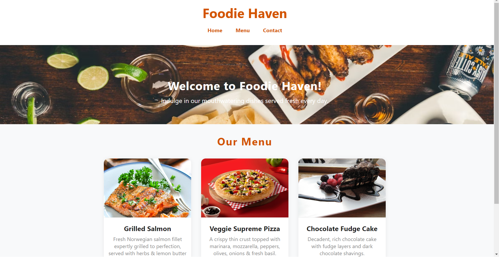

# Ex.07 Restuarant Website
## Date:20-11-2025

## AIM:
To develop a static Resturant website to display the menu and services provided by the resturant.

## DESIGN STEPS:

### Step 1:
Requirement collection.

### Step 2:
Creating the layout using HTML and CSS.

### Step 3:
Updating the sample content.

### Step 4:
Choose the appropriate style and color scheme.

### Step 5:
Validate the layout in various browsers.

### Step 6:
Validate the HTML code.

### Step 7:
Publish the website in the given URL.

## PROGRAM:
```
<!DOCTYPE html>
<html lang="en">
<head>
  <meta charset="UTF-8">
  <meta name="viewport" content="width=device-width, initial-scale=1.0">
  <title>Foodie Haven</title>
  <style>
    body {
      margin: 0;
      font-family: 'Segoe UI', Arial, sans-serif;
      background: #f8f9fa;
      color: #222;
    }
    header {
      background: #fff;
      box-shadow: 0 2px 6px rgba(0,0,0,0.05);
      padding: 20px 0;
      text-align: center;
    }
    header h1 {
      margin: 0;
      font-size: 2.5rem;
      color: #d35400;
    }
    nav {
      margin: 15px 0;
    }
    nav a {
      color: #d35400;
      text-decoration: none;
      margin: 0 18px;
      font-weight: bold;
      font-size: 1rem;
      transition: color 0.2s;
    }
    nav a:hover {
      color: #34495e;
    }
    .banner {
      background: url('https://images.unsplash.com/photo-1600891964599-f61ba0e24092?auto=format&fit=crop&w=1200&q=80') center/cover no-repeat;
      color: #fff;
      text-align: center;
      padding: 100px 0 60px 0;
      margin-bottom: 30px;
    }
    .banner h2 {
      font-size: 2.2rem;
      letter-spacing: 1px;
      margin: 0 0 10px 0;
    }
    .banner p {
      font-size: 1.2rem;
      margin: 0;
    }
    .menu-section {
      max-width: 860px;
      margin: 30px auto;
      padding: 0 16px;
    }
    .menu-section h2 {
      color: #d35400;
      text-align: center;
      font-size: 2rem;
      margin-bottom: 32px;
      letter-spacing: 2px;
    }
    .menu-items {
      display: grid;
      grid-template-columns: repeat(auto-fit, minmax(240px, 1fr));
      gap: 30px;
    }
    .menu-card {
      background: #fff;
      border-radius: 14px;
      box-shadow: 0 2px 12px rgba(0,0,0,0.07);
      overflow: hidden;
      transition: box-shadow 0.2s;
      text-align: center;
      padding-bottom: 18px;
    }
    .menu-card img {
      width: 100%;
      height: 180px;
      object-fit: cover;
      border-bottom: 1px solid #eee;
    }
    .menu-card h3 {
      margin: 15px 0 7px 0;
      font-size: 1.3rem;
    }
    .menu-card p {
      margin: 0 0 13px 0;
      color: #888;
      font-size: 1rem;
      padding: 0 12px;
    }
    .menu-card .price {
      color: #d35400;
      font-size: 1.2rem;
      font-weight: bold;
    }
    footer {
      background: #fff;
      text-align: center;
      padding: 15px 0;
      margin-top: 40px;
      font-size: 1rem;
      color: #888;
      border-top: 1px solid #eee;
    }
    @media (max-width: 600px) {
      .banner {
        padding: 65px 0 40px 0;
      }
      .menu-section {
        padding: 0 5px;
      }
      .menu-card img {
        height: 120px;
      }
    }
  </style>
</head>
<body>
  <header>
    <h1>Foodie Haven</h1>
    <nav>
      <a href="#">Home</a>
      <a href="#menu">Menu</a>
      <a href="#contact">Contact</a>
    </nav>
  </header>
  <div class="banner">
    <h2>Welcome to Foodie Haven!</h2>
    <p>Indulge in our mouthwatering dishes served fresh every day.</p>
  </div>

  <section class="menu-section" id="menu">
    <h2>Our Menu</h2>
    <div class="menu-items">
      <div class="menu-card">
        
        <h3>Grilled Salmon</h3>
        <p>Fresh Norwegian salmon fillet expertly grilled to perfection, served with herbs & lemon butter sauce.</p>
        <div class="price">₹699</div>
      </div>
      <div class="menu-card">
        
        <h3>Veggie Supreme Pizza</h3>
        <p>A crispy thin crust topped with marinara, mozzarella, peppers, olives, onions & fresh basil.</p>
        <div class="price">₹499</div>
      </div>
      <div class="menu-card">
        
        <h3>Chocolate Fudge Cake</h3>
        <p>Decadent, rich chocolate cake with fudge layers and dark chocolate shavings.</p>
        <div class="price">₹299</div>
      </div>
    </div>
  </section>

  <footer id="contact">
    Contact us: +91 98765 43210 | No.25, Main Street, Chennai <br>
    Open: 11am – 11pm daily
  </footer>
</body>
</html>
```

## OUTPUT:


## RESULT:
The program for designing software company website using HTML and CSS is completed successfully.
